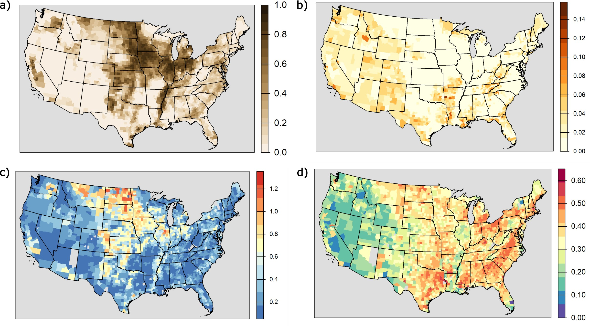

# North-America-tillage-potential
Tillage potential modeling across North America (CONUS)

Models are specified by county and then, for convience, mosaiced to the State-level. 
The data represents the estimated probability (0-1) for each pixel, is in a 32-bit floating-point LZW compressed geotif format with a 30m2 
resoultion and a USGS CONUS Albers Equal Area (EPSG:5070) projection.

PROJ.4 string: +proj=aea +lat_0=23 +lon_0=-96 +lat_1=29.5 +lat_2=45.5 +x_0=0 +y_0=0 +ellps=GRS80 +towgs84=0,0,0,0,0,0,0 +units=m +no_defs +type=crs

# Tillage model result(s) figure 

Figure captions
a) Current tillage as proportion of county,
b) Potential expansion of tillage, represented as the residual difference between potential (proportion of area where tillage probability > 0.65) and current tillage proportion,
c) Mean standard error of model predictions,
d) County-level global log loss validation statistic 

# Data download
The tillage probability dataset is available for download via Zenodo.

https://doi.org/10.5281/zenodo.15596313

