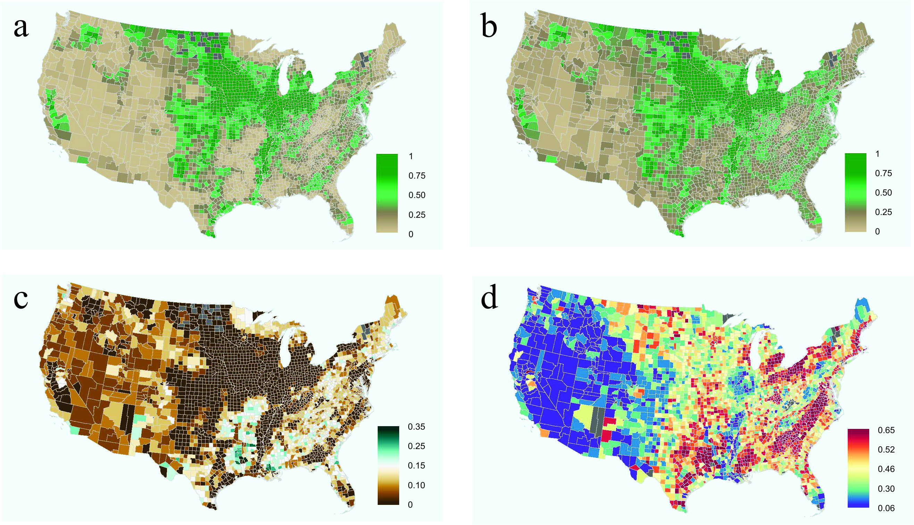

# North-America-tillage-potential
Tillage potential modeling across North America (CONUS)

Models are specified by county and then, for distribution, mosaiced to the State-level.
Data represents the estiamted probability (0-1) for each pixel, is in a geotif format with a 30m2 
resoultion and, in a USGS CONUS Albers Equal Area (EPSG:5070) projection.

CRS string: +proj=aea +lat_1=29.5 +lat_2=45.5 +lat_0=23 +lon_0=-96 +x_0=0 +y_0=0 +ellps=GRS80 +towgs84=0,0,0,0,0,0,0 +units=m +no_defs

# Tillage model result(s) figure 

Figure captions
a) Current tillage as proportion of county,
b) potential tillage as proportion of county,
c) potential expansion of tillage in county, residuals of Δ(potential, current) and,
d) The county-level global log loss validation statistic (note; no county-level model exceeded our
validation threshold indicating that a model should be rejected).

# State AWS S3 download

[Alabama](https://s3.amazonaws.com/TillageModel/tillage/model/Alabama/Alabama_probs.tif)

[Arizona}(https://s3.amazonaws.com/TillageModel/tillage/model/Arizona/Arizona_probs.tif)

[Arkansas](https://s3.amazonaws.com/TillageModel/tillage/model/Arkansas/Arkansas_probs.tif)

[California](https://s3.amazonaws.com/TillageModel/tillage/model/California/California_probs.tif)

[Colorado](https://s3.amazonaws.com/TillageModel/tillage/model/Colorado/Colorado_probs.tif)

[Connecticut](https://s3.amazonaws.com/TillageModel/tillage/model/Connecticut/Connecticut_probs.tif)

[Delaware](https://s3.amazonaws.com/TillageModel/tillage/model/Delaware/Delaware_probs.tif)

[Florida](https://s3.amazonaws.com/TillageModel/tillage/model/Florida/Florida_probs.tif)

[Georgia](https://s3.amazonaws.com/TillageModel/tillage/model/Georgia/Georgia_probs.tif)

[Idaho](https://s3.amazonaws.com/TillageModel/tillage/model/Idaho/Idaho_probs.tif)

[Illinois](https://s3.amazonaws.com/TillageModel/tillage/model/Illinois/Illinois_probs.tif)

[Indiana](https://s3.amazonaws.com/TillageModel/tillage/model/Indiana/Indiana_probs.tif)

[Iowa](https://s3.amazonaws.com/TillageModel/tillage/model/Iowa/Iowa_probs.tif)

[Kansas](https://s3.amazonaws.com/TillageModel/tillage/model/Kansas/Kansas_probs.tif)

[Kentucky](https://s3.amazonaws.com/TillageModel/tillage/model/Kentucky/Kentucky_probs.tif)

[Louisiana](https://s3.amazonaws.com/TillageModel/tillage/model/Louisiana/Louisiana_probs.tif)

[Maine](https://s3.amazonaws.com/TillageModel/tillage/model/Maine/Maine_probs.tif)

[Maryland](https://s3.amazonaws.com/TillageModel/tillage/model/Maryland/Maryland_probs.tif)

[Massachusetts](https://s3.amazonaws.com/TillageModel/tillage/model/Massachusetts/Massachusetts_probs.tif)

[Michigan](https://s3.amazonaws.com/TillageModel/tillage/model/Michigan/Michigan_probs.tif)

[Minnesota](https://s3.amazonaws.com/TillageModel/tillage/model/Minnesota/Minnesota_probs.tif)

[Mississippi](https://s3.amazonaws.com/TillageModel/tillage/model/Mississippi/Mississippi_probs.tif)

[Missouri](https://s3.amazonaws.com/TillageModel/tillage/model/Missouri/Missouri_probs.tif)

[Montana](https://s3.amazonaws.com/TillageModel/tillage/model/Montana/Montana_probs.tif)

[Nebraska](https://s3.amazonaws.com/TillageModel/tillage/model/Nebraska/Nebraska_probs.tif)

[Nevada](https://s3.amazonaws.com/TillageModel/tillage/model/Nevada/Nevada_probs.tif)

[New Hampshire]((https://s3.amazonaws.com/TillageModel/tillage/model/New Hampshire/New Hampshire_probs.tif)

[New Jersey](https://s3.amazonaws.com/TillageModel/tillage/model/New Jersey/New Jersey_probs.tif)

[New Mexico](https://s3.amazonaws.com/TillageModel/tillage/model/New Mexico/New Mexico_probs.tif)

[New York](https://s3.amazonaws.com/TillageModel/tillage/model/New York/New York_probs.tif)

[North Carolina](https://s3.amazonaws.com/TillageModel/tillage/model/North Carolina/North Carolina_probs.tif)

[North Dakota](https://s3.amazonaws.com/TillageModel/tillage/model/North Dakota/North Dakota_probs.tif)

[Ohio](https://s3.amazonaws.com/TillageModel/tillage/model/Ohio/Ohio_probs.tif)

[Oklahoma](https://s3.amazonaws.com/TillageModel/tillage/model/Oklahoma/Oklahoma_probs.tif)

[Oregon](https://s3.amazonaws.com/TillageModel/tillage/model/Oregon/Oregon_probs.tif)

[Pennsylvania](https://s3.amazonaws.com/TillageModel/tillage/model/Pennsylvania/Pennsylvania_probs.tif)

[Rhode Island](https://s3.amazonaws.com/TillageModel/tillage/model/Rhode Island/Rhode Island_probs.tif)

[South Carolina](https://s3.amazonaws.com/TillageModel/tillage/model/South Carolina/South Carolina_probs.tif)

[South Dakota](https://s3.amazonaws.com/TillageModel/tillage/model/South Dakota/South Dakota_probs.tif)

[Tennessee](https://s3.amazonaws.com/TillageModel/tillage/model/Tennessee/Tennessee_probs.tif)

[Texas](https://s3.amazonaws.com/TillageModel/tillage/model/Texas/Texas_probs.tif)

[Utah](https://s3.amazonaws.com/TillageModel/tillage/model/Utah/Utah_probs.tif)

[Vermont](https://s3.amazonaws.com/TillageModel/tillage/model/Vermont/Vermont_probs.tif)

[Virginia](https://s3.amazonaws.com/TillageModel/tillage/model/Virginia/Virginia_probs.tif)

[Washington](https://s3.amazonaws.com/TillageModel/tillage/model/Washington/Washington_probs.tif)

[West Virginia](https://s3.amazonaws.com/TillageModel/tillage/model/West Virginia/West Virginia_probs.tif)

[Wisconsin](https://s3.amazonaws.com/TillageModel/tillage/model/Wisconsin/Wisconsin_probs.tif)

[Wyoming](https://s3.amazonaws.com/TillageModel/tillage/model/Wyoming/Wyoming_probs.tif)

